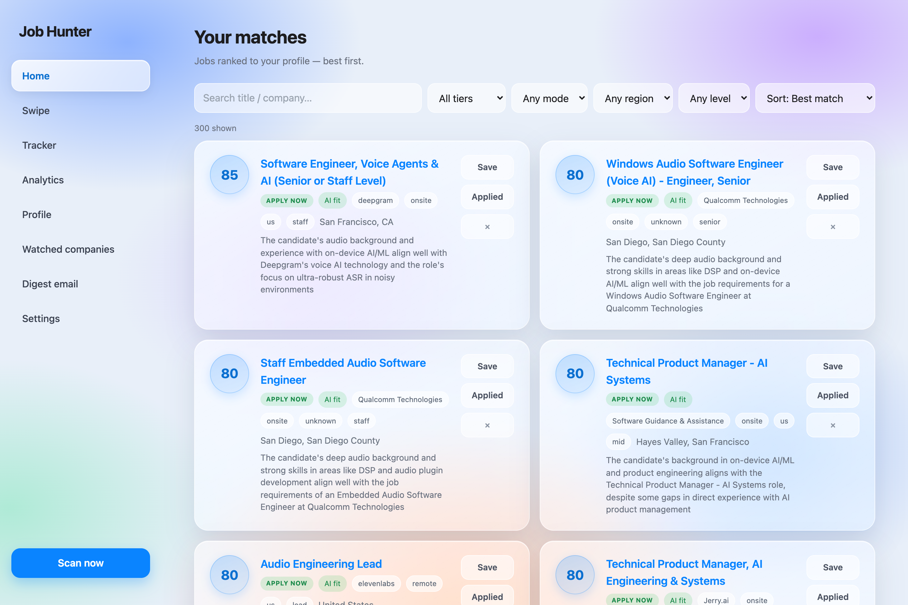
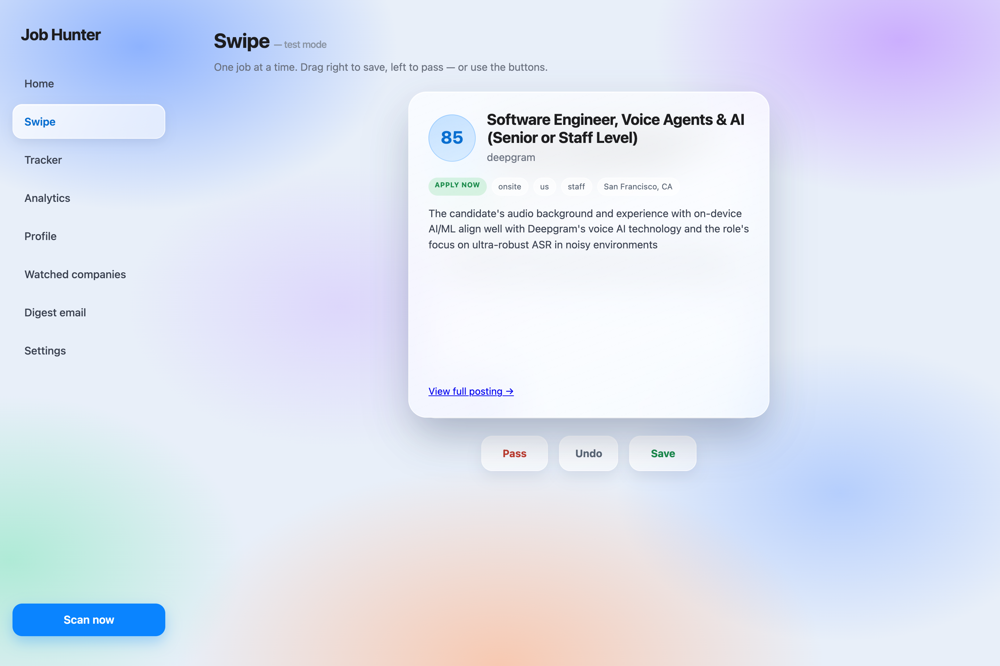
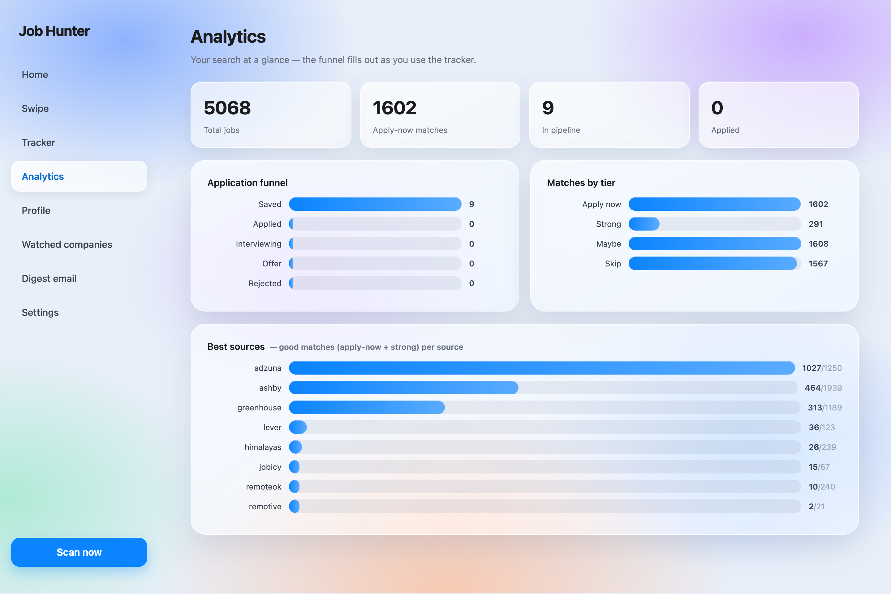
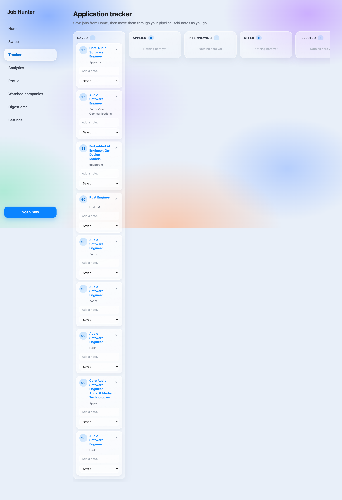
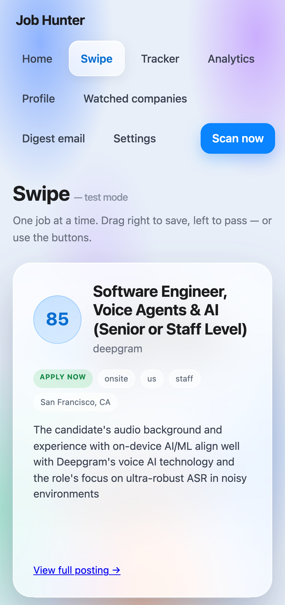
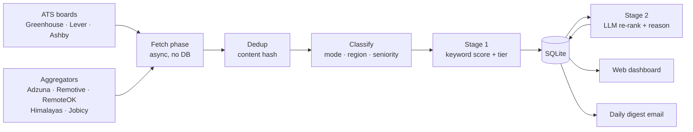

# Job Hunter

**A self-hosted job search engine that scans real company job boards, scores every posting against *your* profile with a two-stage keyword→LLM pipeline, and emails you a ranked digest every morning.**

Built in Rust as a single self-contained binary — embedded SQLite, embedded web UI, no external services required to run. Everything stays on your own machine.



---

## Why

Job boards are noisy. Aggregators bury the good roles under hundreds of near-misses, and "match %" on the big sites is a black box. I wanted something that:

- pulls straight from **company ATS boards** (Greenhouse, Lever, Ashby) *and* broad aggregators, deduped into one list;
- scores each job against a profile I control — target roles, skills, interests, dealbreakers, work-mode and region preferences — with **transparent, tunable weights**;
- uses an LLM only where it earns its keep: a **second-stage re-rank** of the shortlist, with a written reason for each match;
- runs **entirely locally**, keeps my resume and API keys on my own disk, and just emails me the day's best matches.

So I built it. It now runs 24/7 on a Raspberry Pi and emails me a ranked shortlist at 7 AM.

---

## Features

**Sourcing**
- 3 ATS integrations (**Greenhouse, Lever, Ashby**) — watch any company by pasting its careers URL
- 5 aggregators (**Adzuna, Remotive, RemoteOK, Himalayas, Jobicy**)
- Paste-a-careers-page detection: sniffs a custom page's HTML for an embedded ATS board
- Optional LLM reader that turns an arbitrary careers page into structured jobs
- Stable content-hash **deduplication** across all sources

**Scoring**
- **Stage 1 — keyword model:** a transparent weighted score over title + description (fast, runs on every job)
- **Stage 2 — LLM re-rank:** Groq reads the shortlist against your bio and returns a genuine fit score, tier, and a one-line reason
- Structured classification at ingest: **work mode** (remote/hybrid/onsite), **region**, **seniority** — so filters work on clean columns, not messy location strings
- Tiering: `Apply now` / `Strong` / `Maybe`, with thresholds you can tune

**Using it**
- Glassmorphism web dashboard (single embedded HTML file)
- **Home** — a "Tinder for jobs" triage: only shows postings you haven't seen; save / apply / dismiss swipes each card away with directional fly-out + undo
- **Swipe** — one job at a time, drag right to save / left to pass (works great on a phone)
- **Tracker** — a saved → applied → interviewing → offer pipeline board
- **Analytics** — funnel, matches by tier, and which sources actually produce good matches
- **Daily digest email** via Resend — only new matches since last run

---

## Screenshots

| Swipe (desktop) | Analytics |
|---|---|
|  |  |

| Tracker | Swipe (mobile) |
|---|---|
|  |  |

---

## How it works



The scan is split into an **async fetch phase** (network, no database) and a **sync store phase** (database, no network). Keeping the SQLite connection out of any `.await` is what lets the same pipeline back both the CLI and the web UI's "Scan now" button.

The LLM layer is deliberately **isolated and removable** — with no `GROQ_API_KEY` the app simply runs Stage 1 only and still works.

---

## Tech stack

| Concern | Choice | Why |
|---|---|---|
| Language | **Rust** (2021) | One fast, memory-safe binary; trivial to deploy |
| Web server | **axum** + tokio | Async, minimal, multipart for resume upload |
| Storage | **rusqlite** (`bundled`) | SQLite compiled in — no system DB to install |
| HTTP | **reqwest** (`rustls-tls`) | No system OpenSSL dependency → clean cross-compiles |
| Config | **toml** + **toml_edit** | Human-editable profile; UI edits preserve comments |
| Resume parsing | **pdf-extract** | Pull text from an uploaded resume PDF |
| LLM | **Groq** (HTTP) | Fast, free tier; isolated behind one module |
| Email | **Resend** (HTTP API) | Simple transactional email, free tier |
| Frontend | Single `index.html` via `include_str!` | Zero build step; ships inside the binary |

The whole UI is one HTML file compiled into the executable, so `job_hunter serve` is genuinely all you need — no `node_modules`, no static-file hosting.

---

## Getting started

**Prerequisites:** [Rust](https://rustup.rs) (stable).

```bash
git clone https://github.com/will825/job-hunter.git
cd job-hunter

# Configure (both are gitignored — your data stays private)
cp .env.example .env                 # add your API keys (all optional)
cp profile.example.toml profile.toml # make it yours

cargo build --release
```

### Run the web dashboard
```bash
./target/release/job_hunter serve
# → http://127.0.0.1:8787
```

### Or drive it from the CLI
```bash
job_hunter            # scan all sources and score
job_hunter add <url>  # watch a company (paste its careers URL)
job_hunter list       # list watched sources
job_hunter digest     # send the daily digest email
```

### API keys (all optional — it degrades gracefully)
| Key | Enables | Without it |
|---|---|---|
| `GROQ_API_KEY` | Stage-2 LLM re-rank + reasons | Keyword scoring only |
| `ADZUNA_APP_ID` / `ADZUNA_APP_KEY` | Adzuna aggregator | Other sources still run |
| `RESEND_API_KEY` | Daily digest email | Email is skipped |

Get them free: [Groq](https://console.groq.com) · [Adzuna](https://developer.adzuna.com) · [Resend](https://resend.com).

---

## Always-on deployment

- **macOS** (launchd) — see [`scheduling/SCHEDULING.md`](scheduling/SCHEDULING.md)
- **Linux / Raspberry Pi** (systemd + cron) — see [`scheduling/linux/README.md`](scheduling/linux/README.md)

It currently runs on a **Raspberry Pi 3B** (1 GB RAM, Raspberry Pi OS Lite 64-bit): the web server as a systemd service, the digest on a 7 AM cron job, reachable from anywhere over [Tailscale](https://tailscale.com).

---

## Privacy & security

- **Your data never leaves your machine.** `.env` (keys), `profile.toml` (name, bio, email), and `jobs.db` are all gitignored.
- Only two things are ever sent to third parties, and only if you configure them: job **descriptions** go to Groq for scoring, and the **digest** goes through Resend. No resume or personal data is sent to either.
- The dashboard has **no authentication** — it's designed for `localhost` or a private network (Tailscale), never a public URL.
- No scraping of ToS-protected sites (LinkedIn/Indeed); only official ATS and aggregator APIs.

---

## Project structure

```
src/
  main.rs          # CLI entry + subcommand dispatch (serve / scan / add / digest …)
  server.rs        # axum routes + JSON API for the web UI
  web/index.html   # the entire dashboard (embedded via include_str!)
  pipeline.rs      # fetch → classify → score → store orchestration
  fetchers/        # one file per source (greenhouse, lever, ashby, adzuna, …)
  score.rs         # Stage-1 transparent keyword model
  llm.rs           # Stage-2 Groq re-rank (isolated, removable)
  classify.rs      # work_mode / region / seniority derivation
  detect.rs        # paste-a-URL → watchable source
  custom_page.rs   # optional LLM reader for arbitrary careers pages
  profile.rs       # the scoring profile (TOML, comment-preserving edits)
  db.rs            # SQLite schema, queries, migrations
  email.rs         # Resend digest
scheduling/        # launchd (macOS) + systemd/cron (Linux) deployment
```

---

## Roadmap

- [ ] Tauri desktop wrapper (same Rust core, native window)
- [ ] Richer job descriptions inside the Swipe card
- [ ] More ATS integrations (Workday, SmartRecruiters)
- [ ] Per-source scoring calibration from Tracker outcomes

---

## License

MIT — see [LICENSE](LICENSE).
